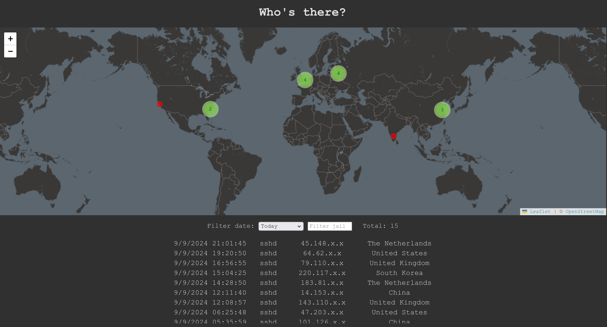

# Who's there?

A simple web app to monitor and locate IPs banned by fail2ban.



## Installation

### 1. Setup web app

#### Locally
To start the web app locally, fill the environment variables in `.env` and run:
```
npm install
npm start
```

#### Through Docker
The web app can be started using the following Docker-compose configuration:
```yml
services:
  whosthere:
    image: ghcr.io/notxia/fail2ban-whos-there:latest
    container_name: whosthere
    restart: unless-stopped
    ports:
      - "3000:3000"
    environment:
      TZ: ${TZ}
      PUBLIC_URL: "http://insert-domain-here"
      DB_PATH: "/ban-data/db.sqlite"
    volumes:
      - ./data:/ban-data
```

Or in plain Docker as:
```bash
docker run                                      \
    --name=whosthere                            \
    --restart unless-stopped                    \
    -p 3000:3000                                \
    -e TZ="timezone/here"                       \
    -e PUBLIC_URL="http://insert-domain-here"   \
    -e DB_PATH="/ban-data/db.sqlite"            \
    -v ./data:/ban-data                         \
    ghcr.io/notxia/fail2ban-whos-there:latest
```

### 2. Setup fail2ban action

A fail2ban action has to be created to notify new bans. A simple example of action is the following:
```conf
# /usually-etc/fail2ban/action.d/whos-there.local

[Definition]
actionban = curl -X POST <domain>/api/bans -H 'Content-Type: application/json' -d '{"ip": <ip>, "jail_name": %(name)s, "timestamp": <time>}'

[Init]
domain = http://localhost:3000
```

Then, the action must be invoked when a ban happens. The following example notifies a ban independently of the jail:
```conf
# /usually-etc/fail2ban/jail.local

action = %(action_)s
         whos-there[domain="https://insert-domain-here"]
```


### (Optional) Import current bans
An easy way to import currently banned IPs is to restart fail2ban. Note that it will unban all banned IPs on shutdown and restore them during its initialization phase.